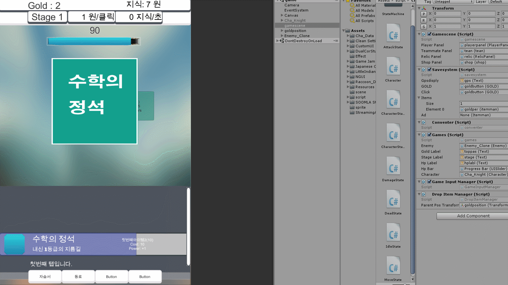
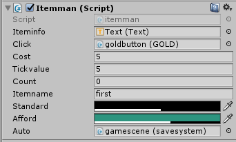
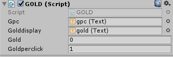
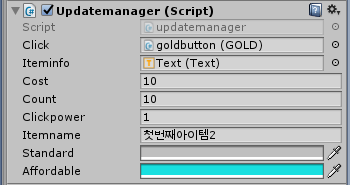
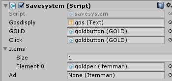
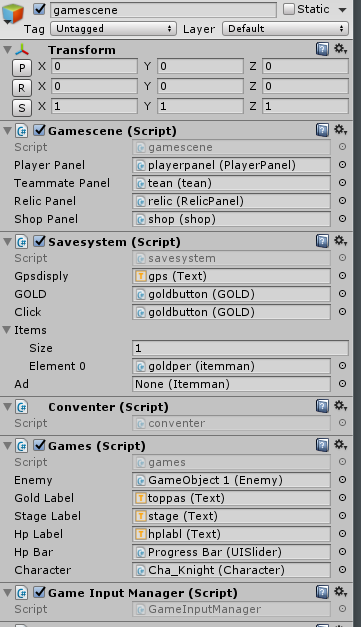

# BasicClickergamescript ( Unity C#)
Auto Save system, item add , item purchase, etc...

# For Example

# How to use?

# plus
IF you want to get full source please contact jhpdevs@gmail.com (free)
